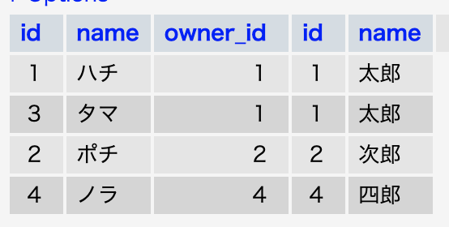
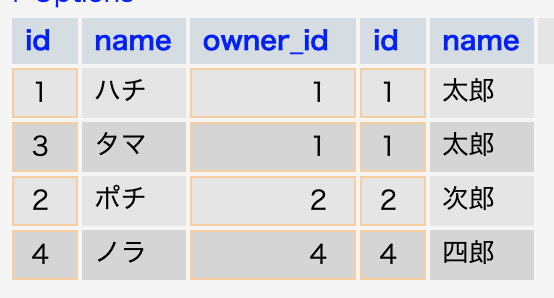
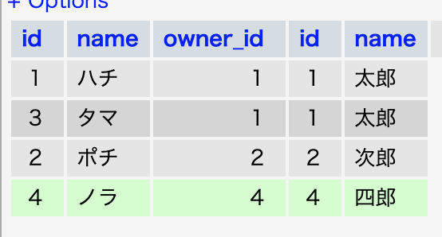
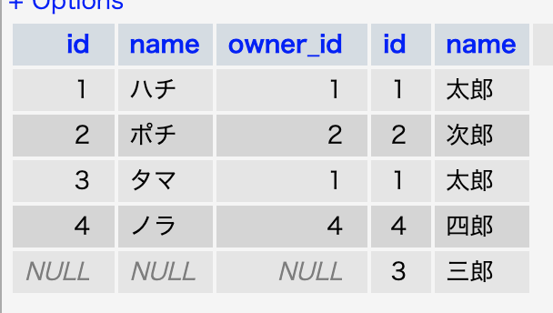

[トップページ](../index.md)  

# テーブル結合(inner joinとouter join)

あらためて自分用にDBの結合について解説。
よく使うのは LEFT JOIN ですかね。
等価結合とINNER JOIN（内部結合）、
LEFT JOIN, RIGHT JOIN(外部結合)について見ていきましょう。


### テーブルの内容

dogsテーブル

|  id  |  name  | owner_id  |
| ---- | ---- | ---- |
|  1  |  ハチ  |  1  |
|  2  |  ポチ  |  2  |
|  3  |  タマ  |  1  |
|  4  |  ノラ  |  4  |

ownersテーブル

|  id  |  name  |
| ---- | ---- |
|  1  |  太郎  |
|  2  |  次郎  |
|  3  |  三郎  |
|  4  |  四郎  |

太郎は２匹の犬（ハチとタマ）を飼っていて、三郎は犬を飼っていません。

### 内部結合と外部結合

２つのテーブルを結合する方法として、大きく内部結合と外部結合というものが存在します。

#### 内部結合と等価結合

内部結合は、それぞれのテーブルの指定したカラムの値が一致するものだけを結合します。

**内部結合**

```sql
// sql文

SELECT * FROM dogs
INNER JOIN owners
ON dogs.owner_id = owners.id;
```

結果


三郎がいませんね。両方のテーブルに合致するデータのみ出力されます。

**等価結合**

```sql
// sql文

SELECT * FROM
dogs,owners 
WHERE dogs.owner_id = owners.id;
```

結果


**内部結合の場合、ベースとなるテーブルから条件にマッチするレコードがないものは削除** されます。
等価結合は、内部結合と同じです（厳密には違いますが）。


---

#### 外部結合

外部結合は、内部結合のようにそれぞれのテーブルの指定したカラムの値が一致するものを結合するのに加え、どちらかのテーブルにしか存在しないものに関しても取得します。

**外部結合 LEFT JOIN**

```sql
// sql文

SELECT * FROM
dogs LEFT JOIN owners 
ON dogs.owner_id = owners.id;
```

結果


構文の左側にある「dogsテーブル」を基準にしています。
dogsテーブルには「空き」がないのでわかりにくいですが、次のRIGHT JOINを見てください。

**外部結合 RIGHT JOIN**

```sql
// sql文

SELECT * FROM
dogs RIGHT JOIN owners 
ON dogs.owner_id = owners.id;
```

結果


ownersテーブルを基準に出力されているのがわかりますでしょうか？
実際はだいたい基準になるテーブルを左側にしてLEFT JOINするものと思いますが、どちらを使っても同じで、「どちらのテーブルを基準にデータを取得したいか？」で使い分けます。

---

### まとめ

今まで雰囲気でやっていたことは否めない。
ORMさまさまです・・・

[トップページ](../index.md)  
