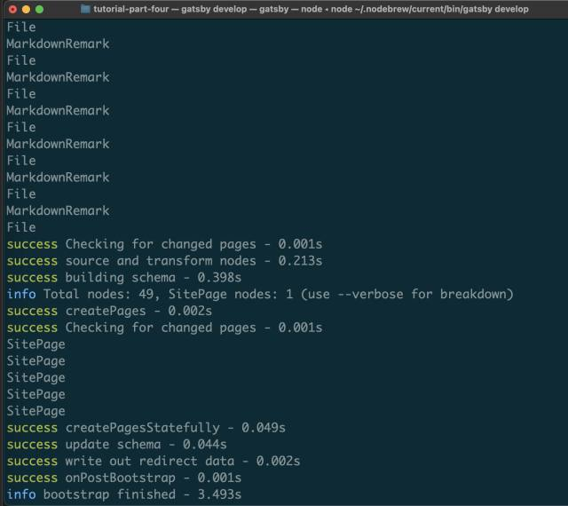

[トップページ](../index.md)  

# Gatsby公式チュートリアルでややハマったこと

Vue一家に所属していたわけですが、reactファミリーも少し覗いてみようと思い門を叩きました。

※macでの操作になります。

```Terminal
//Terminal

node -v
v15.11.0
```

## CSSをimportする時に読み込めないエラー発生

セクション２で`tutorial-part-two/src/components/container.js`で「containerなんてねえぞ」と怒られる。

```
// http://localhost:8000/about-css-modules/

Cannot read property 'container' of undefined
  3 |
  4 | export default function Container({ children }) {
> 5 |   return <div className={containerStyles.container}>{children}</div>
    |                          ^
  6 | }

```

import側

```
// components/container.js

import Container from "../components/container"
```

を

```
// components/container.js

import * as Container from “../components/container”
```

で通った。


### ところどころでnpm installの時にエラー

> このエラーは、npmのバージョン7.xから発生します。
>
> --legacy-peer-depsオプションで再試行してください。
> [引用元](https://stackoverflow.com/questions/64718633/unable-to-resolve-dependency-tree-reactjs)

バージョンのバグ？らしく、npm installのオプションに

--legacy-peer-deps

これを付与しろとのこと

```Terminal
// セクション３Terminal

npm install --save gatsby-plugin-typography react-typography typography typography-theme-fairy-gates --legacy-peer-deps
```


### チュートリアル４のパンダで発生

モジュールが足りないと怒られる。
@emotion/reactが解決できない・・・

```

 ERROR #98124  WEBPACK

Generating development SSR bundle failed

Can't resolve '@emotion/react' in
'tutorial_gatsby/tutorial-part-four/src/components'

If you're trying to use a package make sure that '@emotion/react' is installed.
If you're trying to use a local file make sure that the path is correct.

```

調べてみると、@emotion/coreではなく@emotion/reactが必要だということ

@emotion/reactをインストールしてimport部分も@emotion/reactに変更

```Terminal
// Terminal

npm install @emotion/react
```

[引用元](https://stackoverflow.com/questions/65486256/module-not-found-cant-resolve-emotion-react)  

## チュートリアル、セクション７

```
// gatsby-node.js

exports.onCreateNode = ({ node }) => {
  console.log(node.internal.type)
}
```

見るのはターミナルなので注意w（自分は画面からコンソールを見ていて日が暮れそうになりました）



---

### まとめ

サイト制作後、客先のサーバーがPHP5系であり「FTP以外使わないでほしい」という希望に絶望し、フォームはGoogleフォーム、メールもGoogleメールでまかなって、ペラサイトにしてFTPでアップロードする作戦に切り替え。

Nuxt.jsで作ってみるも納期に余裕があったのでGatsbyに挑戦。

その備忘録として。

Gatsbyかなり良いですね！

reactにも慣れていきたいと思います。

[トップページ](../index.md)  